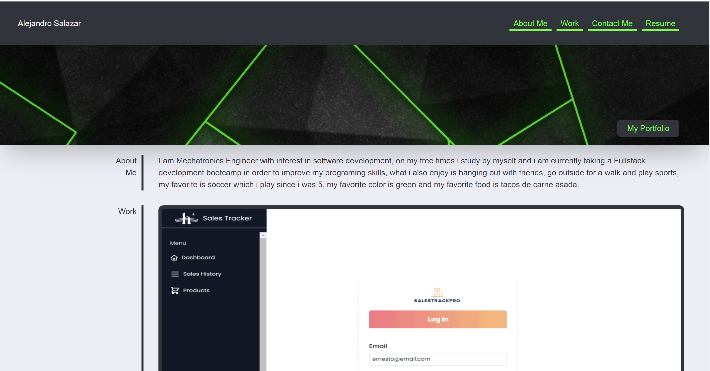

# My-Portfolio

</img>

## Description

This is a webpage used to show Alexslzr projects

## User Story

```
AS AN employer
I WANT to view a potential employee's deployed portfolio of work samples
SO THAT I can review samples of their work and assess whether they're a good candidate for an open position
```

## Mock-Up

The following animation shows the web application's appearance and functionality:




## License

This project utilizes an MIT License. [Read more](https://choosealicense.com/licenses/mit/)

## Links

GitHub: <br>
https://github.com/Alexslzr/My-Portfolio

Portfolio: <br>
https://alexslzr.github.io/My-Portfolio/Develop/index.html